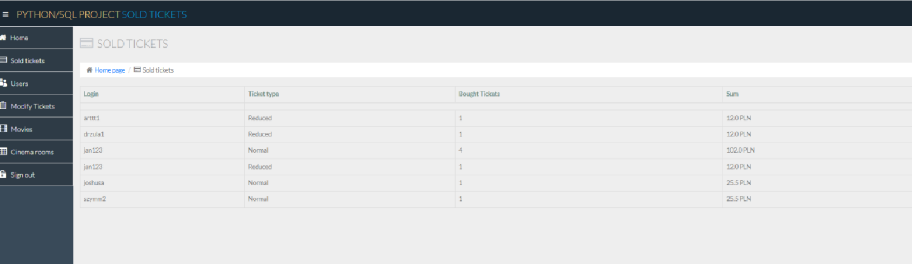

# Machine Learning projects

## [ENG: Traffic on highway](https://github.com/askovr0n/higway_traffic_stacked_regressions_ENG)

- The aim of this project is to explain the traffic on one of the highways for one-hourly intervals based on the training sample and generate predictions for all observations from the test sample
- Due to university requirements, the metric that was used to measure the predictive power of the model was **MAPE** (final score - 29%)
- The training set contained 29701 observations and 8 columns. During the data analysis process, categorical variables were split, additional interactions and variable transformations were introduced, which ultimately led to an expansion of the set to 31 columns
- The process of building the optimal model was based on **backward selection** in which insignificant variables with the highest p-value (significance level = 0.05) were dropped
- Performance was checked on 4 different algorithms: **Support Vector Regressor, Lasso/Ridge Regression and Elastic Net**
- In order to balance the results, the **StackingRegressor** algorithm was used, were Elastic Net was the **meta** regressor

#### Distribution of traffic per hour

## [ENG: Cocaine consumption](https://github.com/askovr0n/drugs_consumption_SMOTE_ENG)

- The aim of the study was to create a prediction of whether a person would use cocaine in the next month
- The training set contained 1500 observations and 21 columns. During the data analysis process, categorical variables were split, additional interactions and variable transformations were introduced, which ultimately led to an expansion of the set to 33 columns 
- Due to university requirements, the metric that was used to measure the predictive power of the model was **balanced accuracy** (the final result achieved was 75%)
- The process of building the optimal model was based on **pipelines** in which **SMOTE** (due to a strongly unbalanced target variable) standardisation of variables (**RobustScaler**) was carried out and selection of the 15 best variables due to **mutual information**
- Performance was checked on 13 different algorithms, however, as a last resort due to university requirements, hyperparameter tuning was carried out for only three: **SVM, KNN and logistic regression**
- In order to balance the results, the **VotingClassifier** algorithm was used with a **soft parameter**, so that the predictions depended on the probability of belonging to a positive class.

Sample chart from EDA     |  Cross validation scores
:-------------------------:|:-------------------------:
  |  

## [ENG: Market Basket Analysis](https://rpubs.com/askovron/mba-associationrules)

- The dataset has 38765 rows of the purchase orders of people from the grocery stores
- The work uses **unsupervised learning method based on association rules: Apriori Algorithm**
- This method might be helpful to estimate the behaviour of a client who does the shopping, by estimating, which other products the customer is going to select, basing on his current products in basket.
- In order to obtain the highest possible results, four metrics need to be maximised: support, confidence, expected confidence, lift
- Jaccard index was calculated in order to obtain probability that some two products will be bought together
- R software was used for data mining, engineering and modelling. For more details, I invite you to visit the full project description, published on [Rpubs](https://rpubs.com/askovron/mba-associationrules)

Snapshot of EDA           |  Apriori visualisation
:-------------------------:|:-------------------------:
  |  

## [ENG: Dimensionality Reduction - case of macro ingredients of pizzas](https://github.com/askovr0n/Pizza-PCA-TSNE-R-ENG)

- The dataset contains measurements that capture the kind of things that make a pizza tasty
- The work uses **unsupervised learning method based on dimensionality reduction: PCA and T-SNE**
- Kaiser criterion was used in order to improve "reduction quality"
- PCA algorithm found that 3 components were sufficient to gather some information about the macronutrients of the pizzas
- In the case of T-SNE, some difficulty was found with the interpretation of the results. This is most likely due to a too small data set
- R software was used for data mining, engineering and modelling. Additionaly, the paper has been published on the [Rpubs website](https://rpubs.com/askovron/pca-tsne-pizza)

Variables impact on dimensional spaces          |  PCA quality representation
:-------------------------:|:-------------------------:
  |  

## [ENG: Which countries should receive financial aid first?](https://github.com/askovr0n/Financial-aid-kmeans-pam-mbc-R-ENG)

- Dataset contains information about socio-economic and health factors for 167 countries
- The work uses **unsupervised learning method based on clustering: Kmeans, PAM, Hierarchical Clustering and Model Based Clustering**
- The Hopkins metric (if dataset has "clustering" characteristics) was used for prediagnostic purposes, while the Sillhoutte and GAP method was used to select the optimal number of clusters
- The paper considers that minimising the variables import, export, income and maximising the variable inflation rate, defines the countries that appear to be the poorest
- The analysis shows that we should divide countries into 3 categories in terms of wealth, where the poorest group of countries mostly included countries from Africa. Therefore, the results of the analysis were considered to be in line with reality
- R software was used for data mining, engineering and modelling. Additionaly, the paper has been published on the [Rpubs website](https://rpubs.com/askovron/financial-aid-clustering)

Snapshot of EDA          |  Clustering - KMeans/PAM
:-------------------------:|:-------------------------:
  |  

# Econometrics projects

## [ENG: Binary choice models](https://github.com/askovr0n/binary_choice_models_econometrics_ENG)

- The aim of this paper is mainly focused on the properties and the diagnosis of the model estimating the probability of default, rather than the correct estimation of the results on the test set
- The data for the model was obtained from a competition called ["Give Me Some Credit!"](https://www.kaggle.com/datasets/brycecf/give-me-some-credit-dataset) from Kaggle.com
- Three models were performed in order to get estimations: **logit, probit and OLS for binary dependent variable (Linear Probability Model) using White's robust matrix**
- The **AIC and BIC information criterion** verified that the probit model appeared to be the most optimal and was therefore used for the following analyses
- A **"general-to-specific"** procedure was used to eliminate irrelevant variables
- The correct functional form of the model was checked using **Linktest, Hosmer-Lemeshow test and Osius-Rojek test**
- The research hypotheses were verified using the **Likelihood Ratio Test**. **Marginal effects** were also determined for the model and some R^2 statistics were interpreted
- The disadvantage of the model is certainly that it has an incorrect functional form, which will certainly affect the correct interpretation of the parameters (nevertheless, an attempt was made to repair this model, which was unsuccessful)

Marginal Effects     |  Distribution of defaults
:-------------------------:|:-------------------------:
  |  

## [PL: Analizy szeregów czasowych dotyczących kształtowania się CPI Meksyku oraz liczby wyszukiwań w Google koszykarza Lebrona James’a](https://github.com/askovr0n/ASC-ARIMA-SARIMA-PL)

- For the prediction of the non-seasonal series (Mexico's CPI), 3 extrapolation methods were used: exponential smoothing, the Holt model and ARIMA
- For the seasonal series (number of Lebron James's google searches), the SARIMA model was used
- Both series, were examined in terms of **stationarity (Dickey-Fuller test, KPSS test)** and seasonality (augmented Dickey, Hasha, Fuller test)
- A graphical interpretation of the ACF and PACF functions was used to verify the AR and MA orders
- The AIC and BIC information criteria were used to select the best models
- The project is written in R (modelling) and Demetra (series decomposition) software

#### Average forecast error estimates for models estimating non-seasonal series

## [PL: Determinanty-wartosci-rynkowych-pilkarzy-na-rynku-transferowym-PL](https://github.com/askovr0n/Determinanty-wartosci-rynkowych-pilkarzy-na-rynku-transferowym-PL)

- The paper examines the determinants of the market values of 150 football players from the world's top five leagues in the 2020/2021 season (as of 28/12/2021)
- **Linear regression was used for modelling**
- The assumptions of linear regression were verified, such as correct functional form (RESET test), homoskedasticity (Breusch-Peagan test), normality of the distribution of the residuals (Jarque-Bera test), autocorrelation of the residuals (Durbin-Watson test)
- Outlier observations were examined using standardised residuals, leverage and Cook's distance. The VIF metric was used to test for collinearity between variables
- R software was used for data mining, engineering and modelling
- Significant variables with a significant impact on the price of footballers appeared to be: age of the footballer squared, number of followers on Instagram, number of goals scored

#### Snapshot of quality publication table

# Apps and webscrapping

## [ENG: Webscrapping of wykop.pl website](https://github.com/askovr0n/wykop-webscrapping-bs4-selenium-scrapy-ENG)

- wykop.pl contains articles on current news from Poland and the rest of the world, where users have the opportunity to comment freely (unfortunately these are often hate comments)
- The scope of the analysis is limited to scraping 120 pages of the wykop.pl website, where from each subpage, only the first article was taken into account, which was on the page
- The codes leave open the possibility of changing the scope of the pages analysed as well as the articles. However, please note that if you set the number of scraped pages too high, your requests will be rejected by the website at some point
- In each article, the following articles were scraped: title, nickname of the user who posted the article, number of likes/dislikes/views and all the hashtags that have been placed under the article
- The project was done in 3 different ways using libraries: Beautiful Soup 4, Selenium and Scrapy, which allowed me to check the performance and precision of all the libraries
- In addition, a brief analysis of the data was carried out using the pandas and matplotlib libraries to see which messages dominated the news zone (as at 11.05.2022, 21.30)

Sample chart from EDA     |  Sample output from BeautifulSoup
:-------------------------:|:-------------------------:
  |  

## [ENG: ShinyApp - spotify user panel](https://github.com/askovr0n/shinyApp)

- The project presents basic statistics for each listener such as favourite artists, favourite songs, what type of music we mostly listen to
- In addition, based on the PCA, we have created a simple recommendation system that recommends similar songs to the selected music
- In order to create individual stats for the listener, a special spotifyr package was used, which automatically processes the jsons
- Our app connects directly to the Spotify API, so to see your individual statistics you need to know your id and cookie
- In order to obtain the above login data you need to, among other things: have an account on spotify, log in to [Spotify for Developers]( https://developer.spotify.com/dashboard/login) and then allow data sharing, where in the next section a special id and cookie will be rendered
- Below are sample screenshots of the application's appearance

Favourite tracks   |  Analysis of liked songs  |  Recommendation system
:-------------------------:|:-------------------------:|:-------------------------:
  |    |  

## [ENG: Cinema booking system](https://github.com/askovr0n/cinema-booking-system-python-ENG)

- The aim of the project was to create a website to enable the booking of cinema seats
- The website has two separate interfaces: one for logged-in customers and one for administrators
- Customers can browse the current repertoire, check the details of a selected film, book tickets including the choice of ticket type and modify their personal data
- Admins have the ability to make changes to the repertoire, have a view of all active customers including their purchases and can remove "ghost customers"
- The site infrastructure was written in Python using the **Bottle library**, which connects to a customer database created in **SQL**
- For a full description of the project, see this [link](https://github.com/askovr0n/cinema-booking-system-python-ENG/blob/main/Raport_AS_SS.pdf)

Sample repertoire           |  Sample admin panel
:-------------------------:|:-------------------------:
  |  

# Other projects written in SAS EG

- [Ekonometryczna analiza danych w SAS EG](https://github.com/askovr0n/Ekonometryczna-analiza-danych-PL)
- [Statystyczna analiza danych w SAS EG](https://github.com/askovr0n/Statystyka-Mapy-PCA-KMeans-PL)
